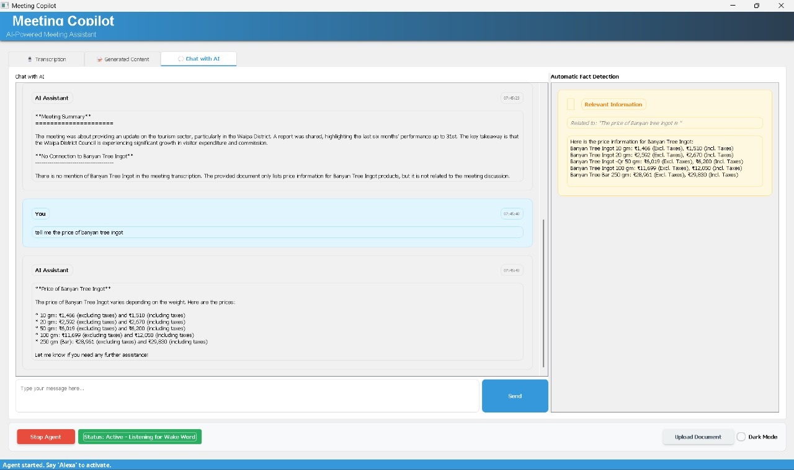

# Team Lusine - Live Meeting Copilot (AIgnite 2025)


A sophisticated AI meeting assistant powered by Google's Gemini API with wake word detection, real-time transcription, and an elegant PyQt-based user interface.

<p align="center">
  
</p>

## 🌟 Features

- **Voice-Activated AI Assistant**: Wake word ("Alexa") activation and voice deactivation ("mute")
- **Real-time Meeting Transcription**: Capture and transcribe meeting content using Speechmatics
- **Natural Language Processing**: Engaging conversations with context retention
- **Calendar Management**: Schedule meetings and retrieve Google Calendar events
- **Multi-modal Interaction**: 
  - **Screen Sharing**: AI can see your screen when requested
  - **Camera Integration**: Visual context through camera
- **Advanced Content Generation**:
  - Meeting summaries
  - Detailed meeting minutes
  - Action item extraction
- **RAG (Retrieval Augmented Generation)**: Query documents for knowledge retrieval
- **Automatic Fact Detection**: Identifies important information and facts during conversations
- **Modern UI Interface**: Elegant PyQt5-based user interface with dark mode support

## 🚀 Getting Started

### Prerequisites

- Python 3.11 or higher
- API Keys:
  - Google Gemini API key
  - Speechmatics authentication token (for transcription)
  - Google Cloud credentials (for calendar integration)
  - GROQ API key (for chat functionality)
- PyQt5 for the user interface

### Installation

1. Clone the repository:
   ```bash
   git clone https://github.com/yourusername/gemini-agent-framework.git
   cd gemini-agent-framework
   ```

2. Create and activate a virtual environment:
   ```bash
   python -m venv .venv
   # On Windows
   .venv\Scripts\activate
   # On macOS/Linux
   source .venv/bin/activate
   ```

3. Install the required dependencies:
   ```bash
   pip install -r requirements.txt
   ```

4. Set up API keys:
   - Create a `credentials.json` file for Google Calendar API
   - Update API keys in `Agent_framework/config/settings.py`

5. Create necessary directories:
   ```bash
   mkdir -p meeting_storage output_storage storage
   touch meeting_storage/transcription.txt output_storage/output.txt
   ```

## 💻 Usage

### Running the Meeting Copilot UI

Launch the Meeting Copilot UI application:

```bash
python app.py
```

The interface includes:
- **Transcription Tab**: Real-time meeting transcription
- **Generated Content Tab**: AI-generated meeting summaries, minutes, and action items
- **Chat with AI Tab**: Interactive conversation with context-aware RAG capabilities


Optional arguments:
- `--mode`: "none", "camera", or "screen" (default: "screen")

### Basic Workflow

1. **Start the Agent**: Click the "Start Agent" button in the UI
2. **Activate with Wake Word**: Say "Alexa" to activate the agent
3. **Speak Naturally**: Have a conversation with the agent
4. **Generate Content**: Use the UI to generate meeting summaries, minutes, or action items
5. **Chat with AI**: Ask questions about the meeting or uploaded documents
6. **Deactivate**: Say "mute" to put the agent back in wake word detection mode

### Document Upload

Upload documents to enhance the agent's knowledge:
1. Click "Upload Document" in the UI
2. Select documents (PDF, TXT, DOCX) relevant to your meeting
3. Documents will be processed and indexed for RAG queries

## 🧩 Project Structure

```
Agent_framework/
  ├── agent/                 # Agent implementation
  │   ├── base_agent.py      # Base agent class
  │   └── live_agent.py      # Gemini live agent implementation
  ├── audio/                 # Audio processing components
  │   ├── audio_utils.py     # Audio device utilities
  │   ├── voice_capture.py   # Voice capture from system audio
  │   └── wake_word.py       # Wake word detection
  ├── config/                # Configuration settings
  │   └── settings.py        # Global settings and API keys
  ├── tools/                 # Tool implementations
  │   ├── base_tool.py       # Base tool class
  │   ├── calendar_tools.py  # Google Calendar integration
  │   ├── image_capture.py   # Camera and screen capture
  │   ├── meeting_content_tools.py # Content generation
  │   └── rag_tools.py       # RAG implementation
  ├── transcription/         # Transcription utilities
  │   └── transcription_help.py # Speechmatics integration
  └── utils/                 # Utility functions
      ├── google_auth.py     # Google API authentication
      └── logger.py          # Logging configuration

static/                      # Web interface files
meeting_storage/             # Storage for meeting transcriptions
output_storage/              # Storage for agent outputs
storage/                     # RAG vector storage
example_copilot_ui.py        # PyQt5 UI application entry point
```

## 🔧 Configuration

### API Keys and Settings

Configure API keys and settings in `Agent_framework/config/settings.py`:

```python
# Gemini API configuration
MODEL = "models/gemini-2.0-flash-live-001"
API_KEY = "your-gemini-api-key"
CHAT_API_KEY = "your-gemini-chat-api-key"
GROQ_API_KEY = "your-groq-api-key"

# Speechmatics API
speechmatics_auth_token = "your-speechmatics-token"

# Audio settings
SEND_SAMPLE_RATE = 16000
RECEIVE_SAMPLE_RATE = 24000
WAKEWORD_THRESHOLD = 0.5
```

### System Prompt Customization

Customize the agent's personality and capabilities by modifying the system prompt in `get_system_prompt()` function in `settings.py`.

## 📊 Tools and Integrations

### Calendar Integration

The agent includes Google Calendar integration for:
- Scheduling meetings with Google Meet links
- Retrieving upcoming calendar events
- Managing appointments


### Meeting Content Generation

Generate meeting content through the UI or with voice commands:


### RAG Document Search

Query uploaded documents for information:


## 📱 UI Features

### Modern Interface

- **Tabbed Interface**: Easy navigation between transcription, generated content, and chat
- **Dark Mode**: Toggle between light and dark themes
- **Automatic Fact Detection**: Highlights important information in real-time
- **Rich Text Formatting**: Styled output for better readability

### Chat with AI Tab

- **Context-Aware Conversation**: Maintains conversation history
- **Document Integration**: References uploaded documents
- **Transcription Context**: Uses ongoing meeting transcription for context
- **Automatic Fact Detection**: Identifies and highlights important information


## 📋 Requirements

The main dependencies include:

- `google-generativeai`: Google Gemini API client
- `pyaudio` and `soundcard`: Audio capture and processing
- `openwakeword`: Wake word detection
- `speechmatics`: Transcription service
- `llama-index`: For RAG implementation
- `PyQt5`: UI framework
- `groq`: GROQ API client for chat functionality
- `sentence-transformers`: For semantic search


## 📄 License

This project is licensed under the MIT License - see the LICENSE file for details.

## 🙏 Acknowledgments

- Google Gemini API for the advanced language model capabilities
- OpenWakeWord for wake word detection
- Speechmatics for transcription services
- PyQt5 for the UI framework
- GROQ for the chat functionality
- All other open-source libraries used in this project
